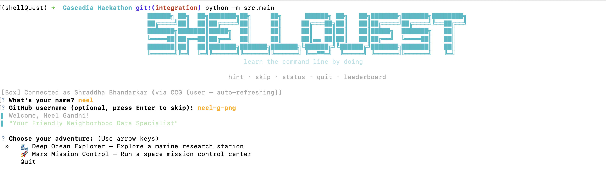

# ShellQuest

> A CLI game that drops you into a themed adventure built from live web content — and teaches you shell commands along the way.



▶️ [Watch the demo](https://youtu.be/lZ_g8NAmh7E?si=Flnpo3BxYagaefDW)

Box stores your world. Apify builds it. A mystery appears in your terminal. You solve it with real bash.

---

## How to play

```bash
pip install -r requirements.txt
cp .env.example .env   # fill in your API keys
python -m src.main
```

You'll be asked for your name, dropped into a sandbox filesystem seeded with real scraped content, and given a situation report. From there, you're on your own.

**Level 1 — Exploration:** The previous team left in a hurry. Figure out what happened using `ls`, `cat`, `mkdir`, `mv`, and `cp`.

**Level 2 — Analysis:** Something went wrong in the data. Find it using `grep`, `wc`, `sort`, `uniq`, and pipes.

**Commands you can use at any prompt:**

| Command | What it does |
|---|---|
| `hint` | Asks Box AI to nudge you in the right direction |
| `status` | Shows your progress and current score |
| `leaderboard` | Pulls the live global leaderboard from Box |
| `skip` | Move on (no points, no judgement) |
| `quit` | Exit cleanly |

**Scoring:** 10–25 pts per challenge. Using a hint costs you 20%. Finishing fast doesn't matter — finishing right does.

---

## Themes

| Theme | Setting |
|---|---|
| 🌊 Deep Ocean Explorer | Marine research station |
| 🚀 Mars Mission Control | Space mission control center |

Each theme scrapes different live content — no two playthroughs are identical.

---

## How Apify is used

- **Theme content** — Apify's `website-content-crawler` scrapes real articles and pages for each theme. The files in your sandbox are built from live web content, not hardcoded text.
- **Shell challenges** — Apify scrapes StackOverflow for real `bash` questions asked by actual developers. After Level 2, one of those questions surfaces as a bonus round.

No Apify token? The game falls back to Wikipedia summaries automatically — still playable, just less fresh.

---

## How Box is used

- **Player state** — your progress is saved to a shared Box folder after every theme. Pick up where you left off from any machine.
- **Contextual hints** — when you type `hint`, the relevant sandbox file is uploaded to Box and Box AI (`/ai/ask`) reads it to give you a nudge specific to your actual data — not generic documentation.
- **Challenge tasks** — each challenge creates a Box Task on the relevant file. As you solve challenges, tasks tick complete in the Box web UI in real time.
- **Global leaderboard** — a single `leaderboard.json` lives in Box, updated after every completion using Box's file lock API to handle concurrent writes safely.
- **Completion certificate** — finishing a theme generates a plain-text report card, uploads it to Box, and returns a public shared link. No login required to view it.

No Box token? Everything falls back to local storage — the game never crashes, it just loses the cloud features.

---

## Requirements

- Python 3.10+
- An Apify API token (free tier works) — [console.apify.com](https://console.apify.com)
- A Box app with CCG auth — [developer.box.com](https://developer.box.com)

Run `python scripts/setup_box.py` once to create the Box folder structure and get your `BOX_STATE_FOLDER_ID`.

---

Built at Cascadia Hackathon by Neel Gandhi & Shraddha Bhandarkar.
